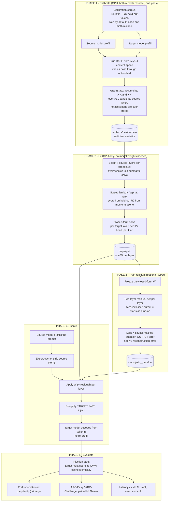
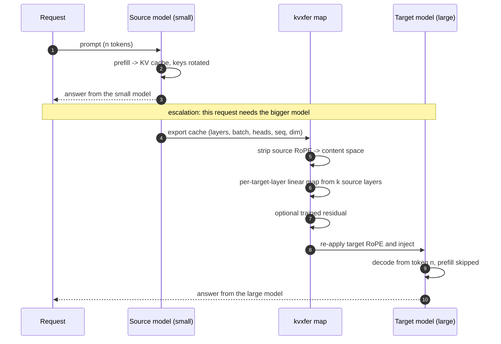

# kvxfer — cross-model KV cache transfer

Reuse a small model's prefill by **mapping its KV cache into a larger
same-family model's format**, instead of re-prefilling the prompt from scratch.

A per-layer linear map is fitted once, offline, from a single calibration pass.
At serve time it converts a source cache into a target cache in ~95 ms for 8k
tokens, against ~871 ms to prefill the same prompt on vLLM.

This replicates and extends **"Cross-Model KV Cache Transfer in LLM Families: A
Closed-Form Linear Mapping for Prefill Reuse"**
([arXiv:2608.03893](https://arxiv.org/abs/2608.03893) — Heo, Shafipour, Zhao et
al., NVIDIA).

> **Status:** research code. The method works and is measured end to end, but
> the honest summary is that it is a **latency optimization, not a quality one** —
> see [Finding 1](#1-retention-against-the-target-hides-when-the-method-stops-paying).

---

## Results at a glance

| | |
|---|---|
| **Replication** | 94.6% ARC-Easy retention on the layer-matched pair, inside the paper's 73–98% band |
| **Speed** | **4.6–9.1× faster than vLLM prefill** when the source model has already run |
| **Generality** | Transfers across Qwen3, Qwen2.5 and Mistral with no algorithmic changes |
| **Best variant** | Plain ridge, plus a small trained residual — [four other ideas failed](#what-failed-and-what-that-says) |
| **Main caveat** | On weaker pairs the mapped cache is **no better than just running the small model** |

Every number below is traceable to committed JSON in [`results/`](results/).
The accuracy and perplexity tables regenerate with `python scripts/make_table.py`
into [`results/TABLES.md`](results/TABLES.md); the latency tables pair
`results/*/latency.json` with `results/*/vllm_prefill.json`.

---

## How it works

The KV cache stores keys *after* RoPE, so a cached key entangles content with
absolute position. Everything here happens in **content space** — keys with the
rotation stripped off — which makes the map position-free, so a map fitted on
1k-token contexts serves 8k-token ones and tolerates a source and target with
different `rope_theta`.



The critical design decision is in **Phase 1**: because ridge regression needs
only `X'X` and `X'Y`, calibration accumulates a Gram over *all* candidate source
layers at once. Every later choice of `(k, layer subset, lambda, alpha, rank)`
is then a submatrix solve on the CPU. One GPU pass buys an unlimited number of
free ablations, and Phase 2 never touches model weights.

### The serving path in detail



**warm** = steps 5-11 only, the escalation case the method exists for, where the
source prefill is sunk cost. **cold** = the whole diagram, paying for the source
prefill too. Both are reported below, because reporting only the warm figure
would inflate the method.

---

## Install

```bash
git clone https://github.com/puneethgv/kvxfer.git
cd kvxfer
python -m venv .venv && source .venv/bin/activate
pip install -e ".[dev]"
```

Python ≥ 3.11. Runs on CUDA, MPS or CPU; the small pairs fit a 16 GB laptop.

## Quickstart

```bash
# 1. calibrate — the only step that needs both models on a GPU
python scripts/calibrate.py --source Qwen/Qwen3-0.6B --target Qwen/Qwen3-1.7B

# 2. choose the penalty out of sample, on each solver's own objective
python scripts/sweep_lambda.py --artifacts artifacts/<pair>/web --target Qwen/Qwen3-1.7B

# 3. fit the maps once and store them (CPU; no model weights loaded)
python scripts/fit_maps.py --artifacts artifacts/<pair>/web --out maps/<pair>

# 4. evaluate — --maps skips refitting
python scripts/fit_and_eval.py --artifacts artifacts/<pair>/web --maps maps/<pair>

# 5. optional: train the residual on the attention-output objective
python scripts/train_residual.py --artifacts artifacts/<pair>/web \
    --maps maps/<pair> --out maps/<pair>__residual

# regenerate every table in this README from committed artifacts
python scripts/make_table.py
```

Steps 3 and 4 are separate processes on purpose. Fitting holds gigabytes of
calibration statistics and evaluation holds two models; running both in one
process makes the peak their sum, which is what the OOM killer reacts to.

## Running on Modal

Pairs too large for a laptop run on Modal. **Always pass `--detach`** — without
it the app is tied to the local client, and a local OOM kill will take down a
GPU run that has nothing to do with it.

```bash
# full pipeline on an L4
modal run --detach modal_app.py --source Qwen/Qwen3-1.7B --target Qwen/Qwen3-4B

# a pair whose weights do not fit 22 GiB (Mistral: 37.8 GB of bf16)
modal run --detach modal_app.py::big --gpu A100-80GB

# latency: map+inject and the vLLM baseline, on the same card
modal run --detach modal_app.py::latency_big --artifacts <pair>/web --gpu A100-80GB
```

The `*_big` local entrypoints exist because `with_options(gpu=...)` is only
reachable from a local entrypoint; `modal run ::evaluate` would silently take
the L4 from the decorator and OOM.

---

## Findings

### 1. Retention against the target hides when the method stops paying

Retention is measured against the target model. It never asks the question a
practitioner actually faces: *is this better than just running the small model?*

| pair | ARC-Easy retention | mapped vs. **source model** |
|---|---|---|
| 0.6B → 1.7B | 94.6% | **+0.1000** (p = 0.001) — clearly worth it |
| 1.7B → 4B | 87.1% | −0.0067 (p = 0.90) — no benefit |
| 0.6B → 4B | 72.5% | +0.0200 (p = 0.55) — no benefit |

Retention still reads as a healthy 72–87% across exactly the region where the
mapped cache stops beating the model you already ran. The metric cannot see the
crossing point; the source baseline can. It is one line of code, and it is
missing from the reference work.

### 2. Mapping is 4–9× cheaper than prefilling, measured against vLLM

Qwen3-1.7B → 4B on an L4, against vLLM with prefix caching **off**. With it on,
vLLM "prefilled" 8192 tokens in 74.5 ms — below the 544 ms floor the card's peak
throughput allows, i.e. it was timing cache hits, not prefills.

| tokens | vLLM prefill | map + inject | **warm** | cold |
|---|---|---|---|---|
| 512 | 106.1 ms | 23.3 ms | **4.56×** | 1.48× |
| 1024 | 175.1 ms | 44.9 ms | **3.90×** | 1.38× |
| 2048 | 332.9 ms | 92.5 ms | **3.60×** | 1.30× |
| 4096 | 723.9 ms | 204.0 ms | **3.55×** | 1.26× |
| 8192 | 1653.0 ms | 418.6 ms | **3.95×** | 1.29× |

The map reaches 15 TFLOPS of the card's ~121, so roughly 8× of implementation
headroom remains against a 13.3× FLOP ceiling.

Ministral-8B → Mistral-Nemo-12B, both halves on one A100-80GB:

| tokens | vLLM prefill | map + inject | **warm** | cold |
|---|---|---|---|---|
| 512 | 60.4 ms | 12.5 ms | **4.84×** | 0.95× |
| 1024 | 108.4 ms | 15.9 ms | **6.80×** | 0.98× |
| 2048 | 202.4 ms | 27.3 ms | **7.41×** | 0.97× |
| 4096 | 413.4 ms | 52.9 ms | **7.82×** | 1.00× |
| 8192 | 871.2 ms | 95.9 ms | **9.09×** | 1.02× |

Warm is more than twice the Qwen3 figure, and predictably so: **the map's cost
scales with `kv_dim²` while the prefill it replaces scales with parameter
count**, and those are independent. Both pairs have 8 KV heads of 128, but
Mistral-Nemo is 12.25B against Qwen3-4B's 4.02B, which puts the ceiling at 36.5×
rather than 13.3×. Both measurements land at 25–30% of their own ceiling, so the
implementation is equally (in)efficient in each.

**Cold is worthless on the Mistral pair — 0.95–1.02×.** Ministral-8B's prefill
costs 758 ms against Mistral-Nemo's 871 ms, because 8B → 12B is only a 1.5× size
ratio. The Qwen3 pair, at 2.3×, manages 1.29×. The method's value therefore
depends entirely on the source model having already run, and shrinks toward
nothing as the two models converge in size. That is a limit on the escalation
story, not a footnote to it.

> Two caveats on how these are measured, both pushing against the method:
> the vLLM figure is time-to-first-token, so it includes one decode step of a
> few milliseconds; and the source-prefill term in **cold** is HuggingFace, not
> vLLM, since no vLLM baseline was run for the source models. The first
> slightly overstates warm, the second understates cold.

### 3. It generalizes across families

Three families, no algorithmic changes — the only code change was capturing
queries from `q_proj` on models that have no per-head query norm:

| pair | family | ARC-Easy retention | mapped vs. source |
|---|---|---|---|
| Qwen3-0.6B → 1.7B | Qwen3 | 94.6% | **+0.1000** (p = 0.001) |
| Qwen3-1.7B → 4B | Qwen3 | 87.1% | −0.0067 (p = 0.90) |
| Qwen3-0.6B → 4B | Qwen3 | 72.5% | +0.0200 (p = 0.55) |
| Qwen2.5-1.5B → 3B | Qwen2 | 94.6% | −0.0166 |
| Ministral-8B → Nemo-12B | Mistral | **99.6%** | −0.0266 |

Mismatched RoPE bases cost nothing measurable: the Mistral pair maps between
θ = 1e8 and θ = 1e6 and still retains 99.6%. That is what the content-space
design predicts, and it had never been tested.

### 4. A trained residual is the only thing that improved on plain ridge

Four closed-form variants failed. The fifth attempt — a small network trained on
**attention-output error** rather than KV reconstruction error — is the first to
help. Qwen3-1.7B → 4B:

| condition | perplexity | ARC-Easy | ARC-Challenge |
|---|---|---|---|
| target (ceiling) | 13.559 | 0.8500 | 0.4967 |
| **source model** | 16.479 | **0.7467** | **0.3800** |
| **ridge + trained residual** | **14.108** | 0.7333 | **0.3533** |
| ridge (reference method) | 14.708 | 0.7400 | 0.3233 |
| floor (zeroed cache) | 19.635 | 0.4267 | 0.1900 |

- **Perplexity: −0.04167 ± 0.00558 nats/token, t = −7.46, 52/64 documents
  improved.** It closes **51%** of the gap ridge leaves to the target.
- **ARC-Challenge: +0.0300 (p = 0.078)**, retention 65.1% → 71.1%.
- **ARC-Easy: −0.0067 (p = 0.79)** — nothing.

It replicates on Mistral, and more strongly: Ministral-8B → Nemo-12B gives
−0.01750 ± 0.00289 nats, t = −6.05, 52/64 documents, closing **69.5%** of ridge's
remaining gap. There too it costs a little ARC accuracy (97.2% against ridge's
99.6%), so the dissociation is a property of the method, not of one pair.

So: a decisive win on generation quality, a marginal one on the harder task, and
**still short of simply running the source model** on both tasks.

### 5. The metric decides the conclusion, repeatedly

This is the reference work's own diagnostic — calibration R² *anti*-correlates
with retention (r = −0.20) — recurring at every level:

- The residual's **training** objective improved 3.0% while downstream perplexity
  improved **51%**. The training curve looked like failure for two hours.
- Same residual, same caches, same run: **51% better perplexity, 0% better
  ARC-Easy.**
- Rank-128 maps hold **R² = 0.54** and score *worse than a zeroed cache*.

Any single number here supports a different conclusion about the same artifact.
That is the argument for reporting all of them.

---

## What failed, and what that says

| attempt | result |
|---|---|
| Attention-aligned penalty (`λ/Λⱼ`) | Null on 5 pairs across 3 families; **α tunes to 0 out of sample**, i.e. the tuned solver *is* ridge. On families without per-head query normalization it is not merely useless but destructive: held-out R² of **−10.1** on Qwen2.5 keys, perplexity in six figures |
| The α family across λ | Monotonically worse; at the selected λ, metric-R² is flat in α while isotropic R² falls |
| Metric-weighted low-rank | Worse at **every** rank (t = +22.7 at rank 512, 0/64 documents improved) |
| Rank truncation | Graceful down to 512, then collapses: 24.30 ppl at 256, 44.28 at 128 — past the 27.33 floor |
| **Trained residual** | **The only one that helps** |

The first four share a cause. In a closed form the attention metric can only
enter *through the penalty*, and reallocating a penalty is second-order against
a design Gram conditioned at 4×10¹¹. Sweeping its influence honestly drives it to
zero. The trained residual is the only variant that optimizes the functional
objective **directly**, and it is the only one that works — which is evidence
about the constraint, not about attention alignment being the wrong idea.

What the residual's ceiling suggests: the target's cache appears predictable from
the source's largely to the extent that it is a *linear* function of it. Ridge
recovers that; 94.4M trained parameters recover about half of what is left in
perplexity terms, and little of it in accuracy terms.

---

## Protocol

Decisions that changed the numbers, and are therefore worth stating:

- **Out-of-sample selection.** `k`, `λ` and `α` are chosen on a held-out
  calibration split, never on the evaluation set. Held-out R² is computed from
  *moments alone*, so a validation split costs one accumulator pass and no
  stored activations.
- **Paired tests.** Conditions are scored on identical items, so per-condition
  error bars overstate the uncertainty of the difference between them. Exact
  McNemar for accuracy, per-document paired t for perplexity.
- **A source-model baseline** in every table. See [Finding 1](#1-retention-against-the-target-hides-when-the-method-stops-paying).
- **Prefix-conditioned perplexity as the primary metric** — one measurement per
  token rather than per item. The multiple-choice tasks leave so little headroom
  on easy pairs that per-item noise swamps the effect.
- **bfloat16 throughout**, matching how the statistics were harvested and how
  these models are served. Logits are upcast to float32 before `log_softmax`.
- **Correctness gates that run against the models being measured**, not only in
  CI. `kvxfer/eval/gates.py::check_injection` requires the target to score its
  own cache identically before any transfer number is recorded. A Mistral pair
  was calibrated, trained and evaluated on rented hardware before anyone noticed
  its target scored at chance through its own cache; the gate exists because of
  that bill.

---

## Requirements and limitations

A source/target pair must satisfy **all three**, and `kvxfer.geometry.check_pair`
rejects it otherwise:

1. **Identical `n_kv_heads` and `head_dim`**, so a source head maps onto the
   corresponding target head with no reshaping. Layer counts may differ.
2. **A shared tokenizer.** Mistral-7B → Ministral-8B has identical KV geometry
   and 32,768 vs 131,072 vocab ids; it produced a nonsensical 107% retention
   before this check existed.
3. **An attention layout this cache path implements.** Enforced at runtime by
   the injection gate rather than statically.

Known non-matches worth internalising: the whole Qwen3 dense family qualifies
(8 KV heads × 128), but **Qwen2.5 does not match across its own sizes** — 0.5B is
`head_dim=64` against 1.5B's 128, and 7B has 4 KV heads against 1.5B's 2, leaving
**1.5B → 3B** as the only matched pair there.

Map cost scales with the **square** of `kv_dim`, so narrow-GQA families are far
cheaper to serve: the same map is 302M parameters for Qwen3 (8 KV heads) and
18.9M for Qwen2.5 (2 KV heads).

Not implemented: sliding-window attention, cross-family transfer, quantized KV,
and any paged-attention integration.

---

## Repository layout

```
kvxfer/
  stats.py         streaming sufficient statistics; one pass serves every (k, subset, λ)
  geometry.py      pair compatibility: KV shape, vocab, layer counts
  rope.py          strip and re-apply rotary embeddings
  cache.py         DynamicCache <-> content space; CacheTemplate for reusable injection
  harvest.py       the calibration pass itself
  mappers.py       Mapper interface, identity/oracle/zero baselines
  mapstore.py      persist fitted maps so fit and eval are separate processes
  planning.py      harvest strategy from MEASURED memory, not from token counts
  experiment.py    one experiment end to end; shared by the CLI and Modal
  solvers/
    ridge.py       the reference method
    whitened.py    attention-aligned closed form, with the α family
    lowrank.py     metric-weighted reduced-rank regression
    neural.py      trained residual on the attention-output objective
  eval/
    ppl.py         prefix-conditioned perplexity (primary metric)
    retention.py   multiple-choice scoring with paired tests
    latency.py     map-and-inject vs. re-prefill, warm and cold
    gates.py       injection gate — run against the models actually measured
scripts/           thin CLIs over the above
modal_app.py       the same code on rented GPUs; *_big entrypoints pick the card
results/           committed JSON + regenerated TABLES.md
tests/             82 tests
```

`stats.py` is the load-bearing design. One Gram over *all* candidate source
layers means every `(k, subset, λ)` choice is a submatrix solve, so one GPU pass
buys an unlimited number of free ablations.

## Tests

```bash
pytest -m "not slow"    # 63 tests, no model weights, ~2s
pytest                  # 82 tests; the other 19 download real checkpoints
```

The slow ones are the gates that matter: identity injection must reproduce the
target's own scores, RoPE must round-trip losslessly, an oracle mapper must give
100% retention, and a zeroed cache must score clearly worse — that last one
guards against a harness that scores well no matter what is injected.

## References

- Heo, Shafipour, Zhao et al. *Cross-Model KV Cache Transfer in LLM Families: A
  Closed-Form Linear Mapping for Prefill Reuse.*
  [arXiv:2608.03893](https://arxiv.org/abs/2608.03893)
